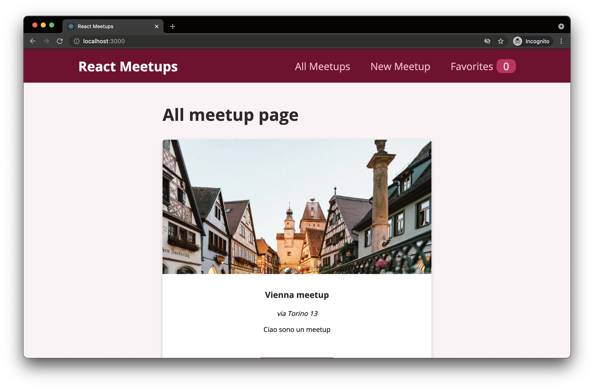

# React meetup app

Basic meetups aplplication.

| \                | \                                                                                                                                                                             |
| ---------------- | ----------------------------------------------------------------------------------------------------------------------------------------------------------------------------- |
| Deploy status    | [](https://app.netlify.com/sites/react-pokemon-app-giulia/deploys) |
| Deploy preview   | https://react-pokemon-app-giulia.netlify.app/                                                                                                                                 |
| Project typology | 📒 Step by step from tutorial [React Crash Course for Beginners 2021](https://www.youtube.com/watch?v=Dorf8i6lCuk)                                                            |



## 🔥 Tech stack

| Purpose       | Technology   |
| :------------ | :----------- |
| Framework     | React        |
| Templating    | JSX          |
| Styling       | SCSS + BEMIT |
| Documentation | Markdown     |

## 🌊 Run development mode

```shell
# install dependencies
npm i

# serve with hot reload at localhost:3000
npm start
```

## 🧳 Build setup

```shell
# build for production
npm run build
```

## 📚 Project documentation

### 🌿 Branches

| Branch name | Use                                            |
| :---------- | :--------------------------------------------- |
| `main`      | production                                     |
| `todo-app`  | todo application at the beginning of the video |
